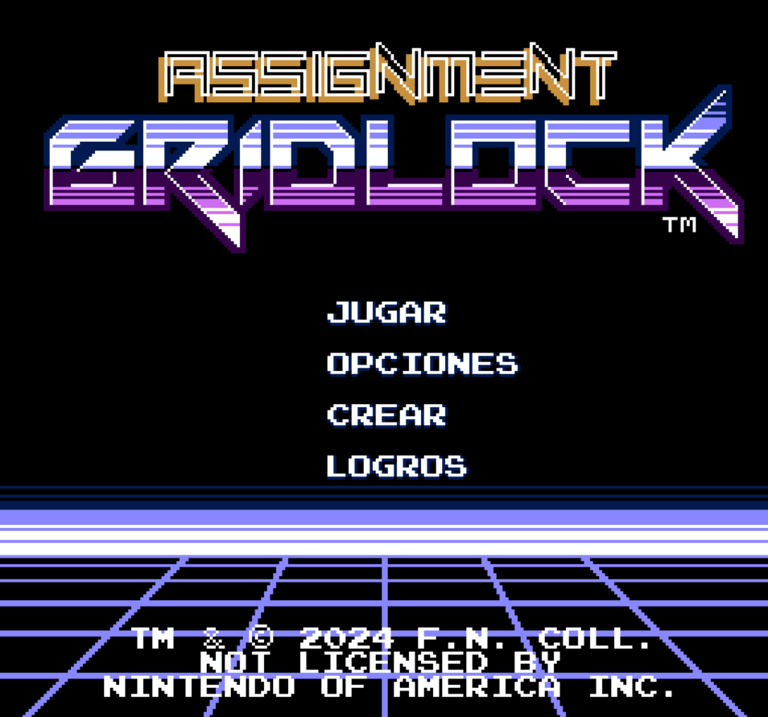
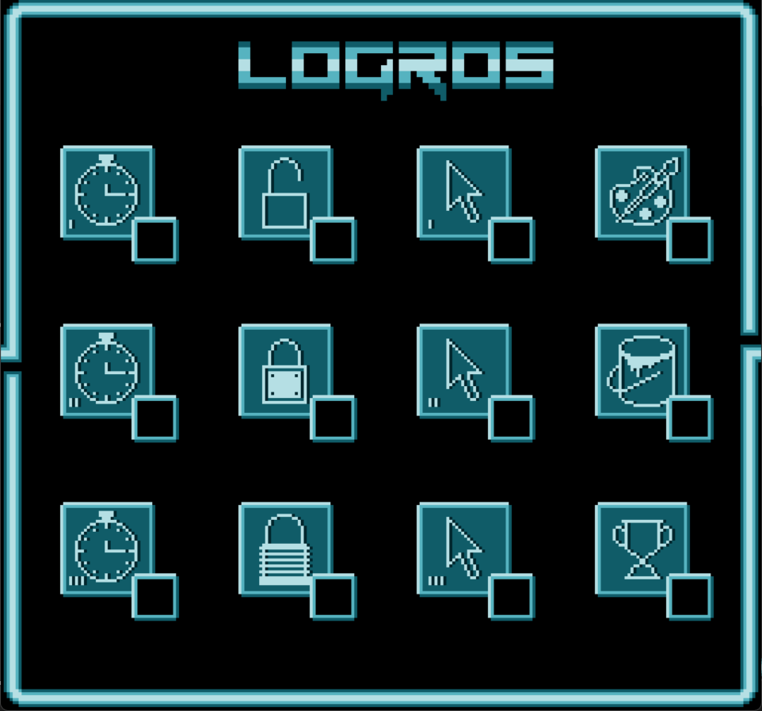
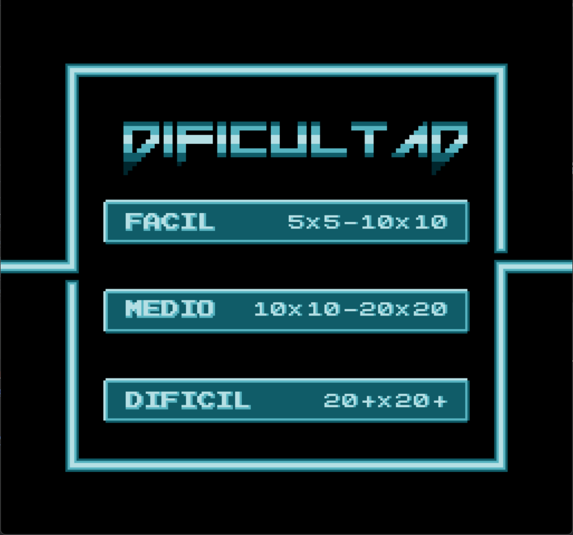
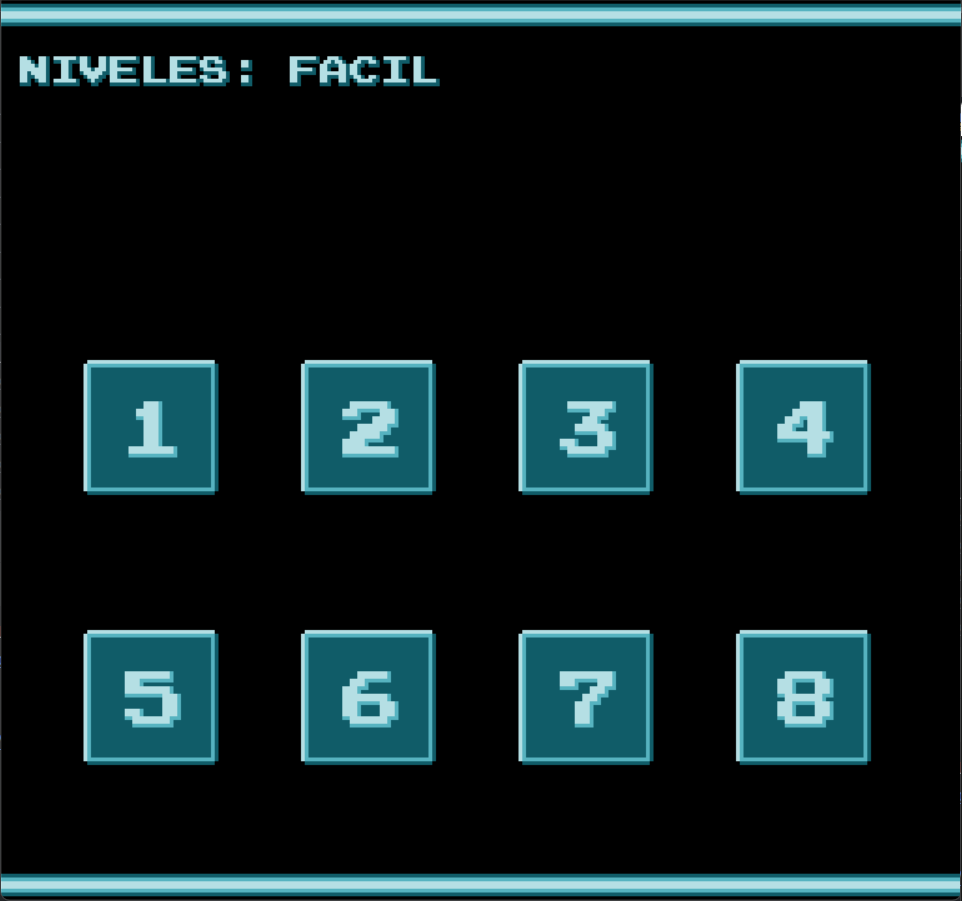
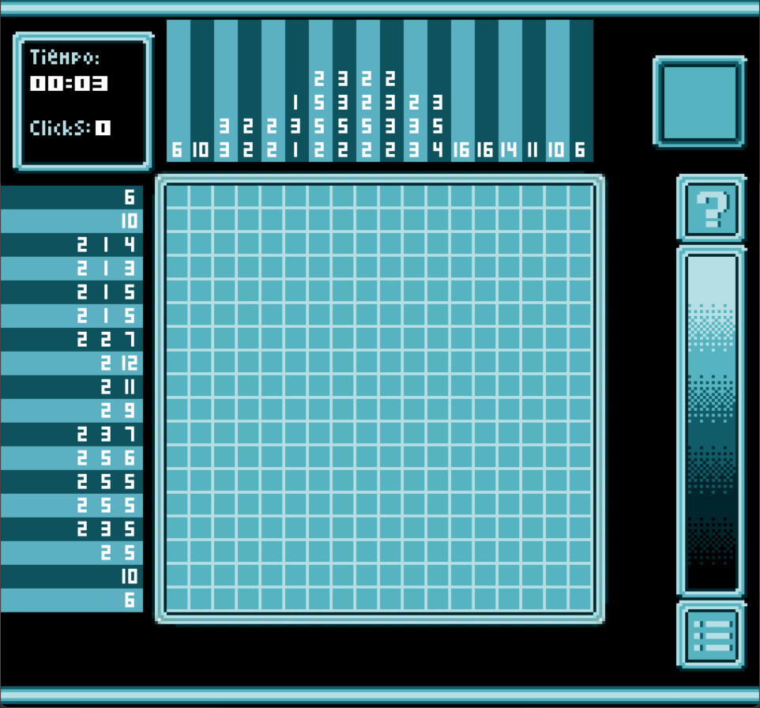
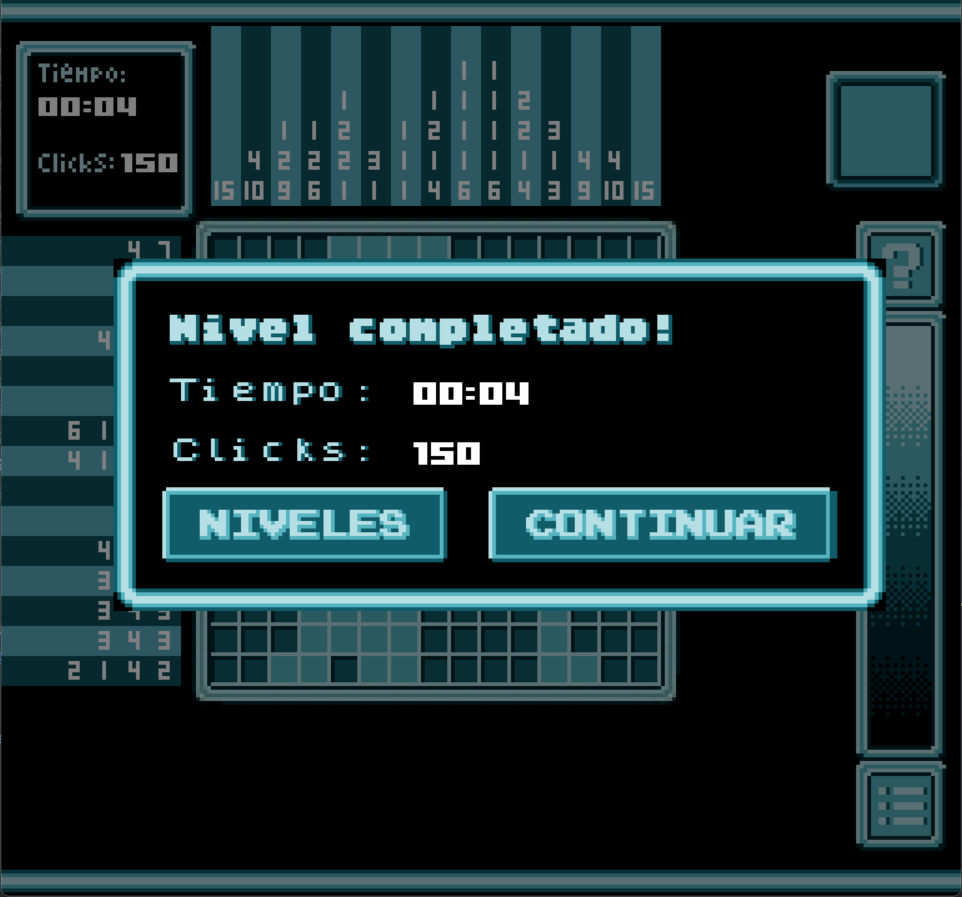

# Proyecto de Progamación - Nonogramas
Este proyecto trata sobre un progama usando Pygame donde se pueden resolver distintos nonogramas, los cuales son 
puzzles lógicos que tratan de resolver una imagen escondida. Para conseguir eso el jugador debe de marcar casillas
en una matriz cuadrada, siguiendo unos números que representan la cantidad consecutivas de estas según fila y columna.

## Características
- Nonogramas de distintos tamaños y niveles de dificultad para resolver.
- Sistemas de Pistas y resolución automática.
- Función de deshacer y rehacer movimientos.
- Opciones para guardar y cargar nonogramas.
- Sistema de logros.
- Estética retro inspirada en los videojuegos clásicos.

## Screenshots













## Instrucciones de uso
1. Navega al directorio raíz del proyecto `PROYECTO-DE-PROGRAMACION`

2. Crea y activa un entorno virtual:
   - En **Linux**:
     ```bash
     python3 -m venv .venv
     source .venv/bin/activate
     ```
   - En **Windows (cmd)**:
     ```bash
     python3 -m venv .venv
     .venv\Scripts\activate
     ```
3. Instala las dependencias:
   ```bash
   pip install -r requirements.txt

4. Ejecuta el programa:
    ```bash
    python3 main.py
   
## Autores
- [Daniel Aburto Rivera](https://github.com/daaburto)
- [Joaquín Sandoval Reyes](https://github.com/joaqsandoval04)
- [Gustavo González Anabalón](https://github.com/SkullKarl)
- [Gustavo Benitez Cespedes](https://github.com/D34dcru1s3r)

# 
[](https://www.pygame.org/docs/)
[](https://skillicons.dev)
[](https://skillicons.dev)
[](https://skillicons.dev)


